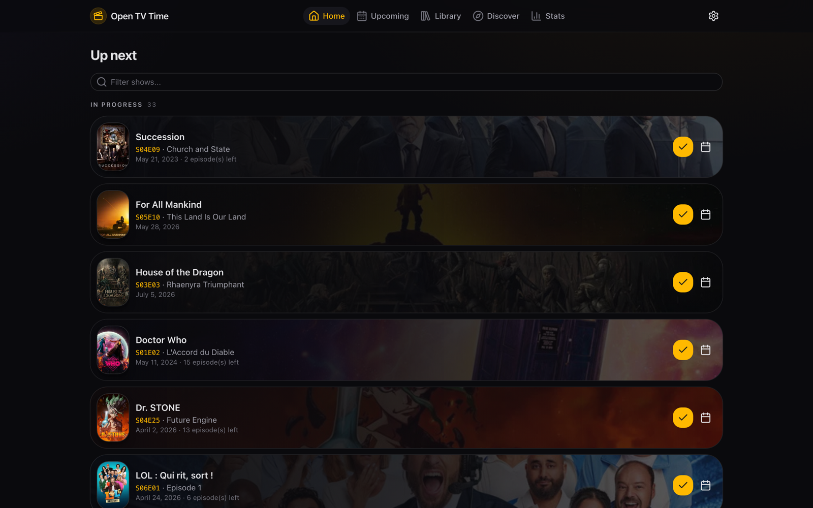
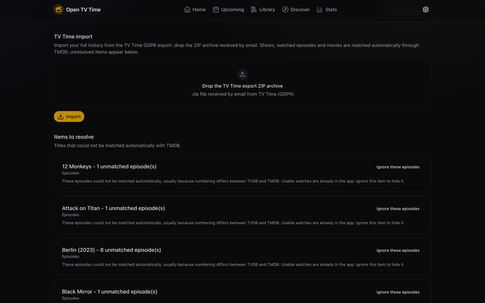
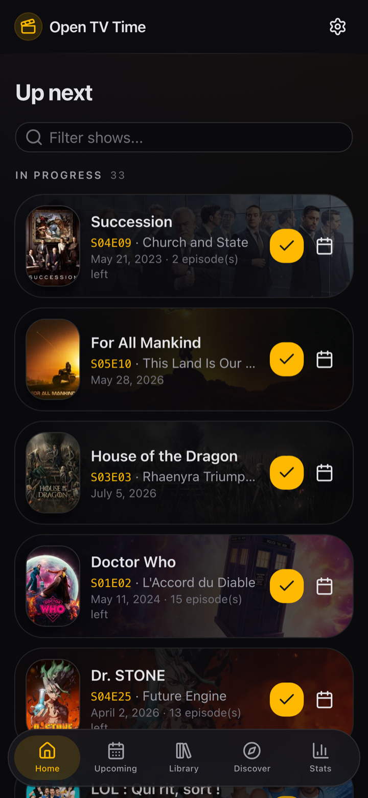
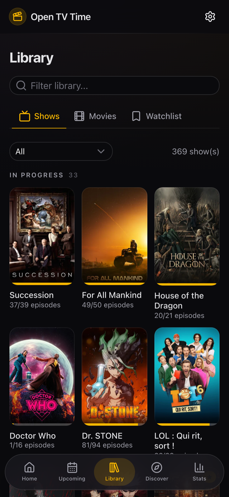
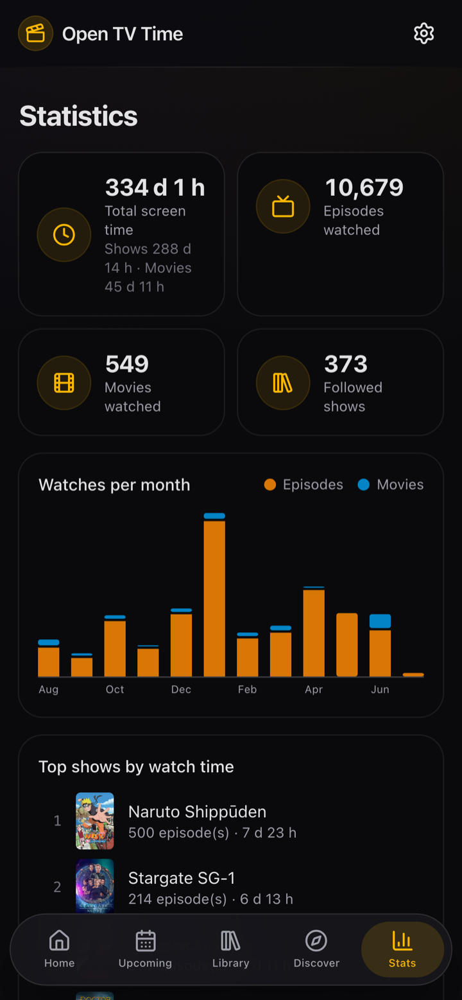

# Open TV Time

Personal TV show and movie tracker.
Nuxt 4 + Nuxt UI + SQLite, TMDB metadata localized from the selected display
language, mobile-first, and self-hosted with Docker. Single-user app, no auth.

## Features

- **Up next home**: next episode to watch per show, sorted by recent activity
- **Upcoming**: release calendar for followed shows and watchlist movies
- **Library**: shows with progress and filters, watched movies, watchlist
- **Show/movie details**: mark watched **with the date**, rewatches, whole seasons, archive/favorite
- **Discover**: TMDB search and trending, follow shows or add movies to the watchlist
- **TV Time import**: drop the TV Time GDPR export ZIP to import your full history
- **Stats**: total watch time, episodes/movies by month, top shows, genres
- **PWA**: installable on a phone home screen
- **Display language**: English by default, configurable in Settings and saved in SQLite

## Screenshots



Import your full TV Time history from the GDPR export, matched against TMDB:



<p>
  
  
  
</p>

## Requirements

A free TMDB API token: create an account on [themoviedb.org](https://www.themoviedb.org),
then open Settings -> API -> **Read Access Token (v4 auth)**.

```bash
# .env at the repository root
NUXT_TMDB_API_KEY=eyJhbGciOi...
```

## Development

```bash
git clone https://github.com/kodelio/opentv-time.git
cd opentv-time
pnpm install
pnpm dev        # http://localhost:3000
pnpm test       # Vitest test suite
pnpm typecheck
```

The SQLite database is created and migrated automatically on startup
(`./data/opentvtime.sqlite`).

## Import From TV Time

1. Request your TV Time data export (GDPR): you will receive a **ZIP** archive by email.
2. Open **Settings** in the app and drop the ZIP archive.
3. The app extracts the CSV files, matches titles through TMDB, and imports shows,
   watched episodes, and movies.
4. Titles that cannot be matched automatically appear in **Items to resolve** on
   the same page for manual reconciliation.

## Deployment (Docker)

On your server (NAS, VPS, Raspberry Pi...), next to `docker-compose.yml`:

```bash
# create .env with the TMDB v4 read token
echo "NUXT_TMDB_API_KEY=eyJhbGciOi..." > .env
docker compose up -d --build
```

The app is exposed on port **3002** by default (`3002:3000`, editable in
`docker-compose.yml`). Followed show metadata is refreshed every night at 5:00
to fetch new episode dates; Settings also includes a **Refresh now** button.

> The container runs as a non-root user: make sure `./data` is writable. Adjust
> `PUID`/`PGID` in `docker-compose.yml` for your host (for example `99:100` on
> Unraid, often `1000:1000` on a standard Linux host).

## Environment Variables

| Variable | Default | Purpose |
|---|---|---|
| `NUXT_TMDB_API_KEY` | - (required) | TMDB v4 read token |
| `NUXT_DATABASE_PATH` | `./data/opentvtime.sqlite` (`/data/...` in Docker) | SQLite file |
| `TZ` | - | Time zone, for example `Europe/Paris` |

## License

[MIT](LICENSE) © 2026 Kodelio SASU — free to use, modify, and redistribute.
